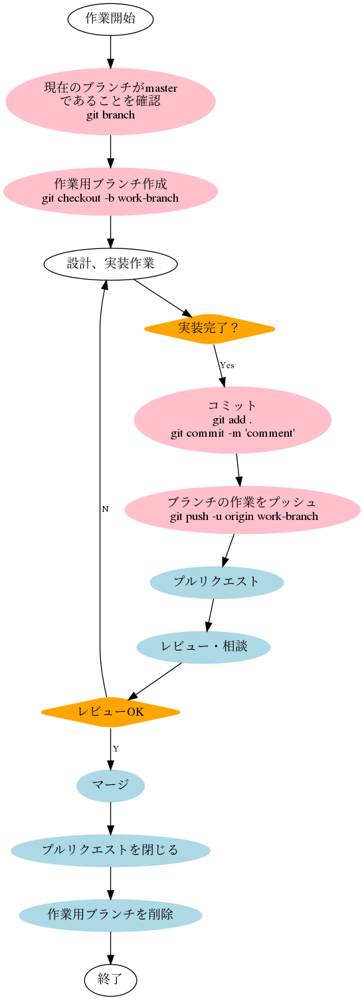

# Lesson2 Github Flow

## はじめに

本道場では、リポジトリの運用方法を`git-flow`ではなく、`GitHub Flow`で行います。

理由は、`git-flow`での運用は複雑すぎてミスが多発するだけでなく、運用管理が大変になるからです。しかし、`git-flow`での運用がどのようなものかを知っておく必要はあるので、参照記事などを一読しておいてください。

以下は重要なポイントだけをピックアップします（説明の都合上、git-flowを引き合いに出しています）。

## GitHub Flowの5つの運用ルール
GitHub Flowでは、ブランチの作り方だけではなく、次のように各ブランチ上での開発の運用も合わせて規定しています。

### ルール1 masterブランチのものはデプロイ可能である
`git-flow`では、`develop`ブランチを利用して開発を進めていましたが、`GitHub Flow`では全ての作業を`master`ブランチへマージするようにし、ブランチモデルを簡単にしています。しかしながら、ブランチに不具合が混入していた場合、リリースしたサービスに影響を与える可能性があります。`master`ブランチへマージするブランチは、テスト、レビューされ、`master`ブランチは常に安定して動作するように保つ必要があります。

### ルール2 masterブランチから各種作業を行うブランチを作成する
`git-flow`では、`feature`ブランチと`release`ブランチは`develop`ブランチから、`hotfix`ブランチは`master`ブランチから作成されました。`GitHub Flow`では、**全てのブランチはmasterブランチから作成します**。緊急のバグフィックスか、新機能の実装かによってブランチの分岐元を分けるようなことはしません。

ブランチの名前は、一目見てその作業が分かるような名前を付けます。それによって、現在アクティブなブランチ一覧を見れば、おおよそどのような作業が行われているか分かるようになります。

本道場では、複数の生徒が1つのリポジトリで作業する場合もあるので、ブランチ名の命名規則を次のように規定します。

ユーザ名-作業の説明

例） bcts369-add-toml-setting <-- tomlによる設定を追加する作業のブランチ名

ただしあまりに長いブランチ名をつけると、見通しが悪くなるので、できるだけ短くわかりやすいブランチ名をつけてください。
また、ブランチ名はできるだけ日本語ではなく、英数字を使ったほうが無用なトラブルに遭遇する機会が減ります。

### ルール3 ブランチを定期的にプッシュする
git-flowでは、ブランチでの作業をローカルで行いdevelopブランチやmasterブランチへマージした後、共有リポジトリへプッシュする運用がありました。GitHub Flowでは、作業用のブランチを定期的にプッシュすることを定めています。

定期的にプッシュすることにより、他の担当者に現在の作業状況を共有でき、また、不意のPCの故障からソースコードを守ることにもつながります。

### ルール4 プルリクエストを利用してレビューを行う
`master`ブランチが常にデプロイ可能なものにするのに重要なのは、**コードレビュー**です。`GitHub Flow`は、GitHubのプルリクエストの機能を利用して、ソースコードのレビューを行い、`master`ブランチにマージします。

### ルール5 マージされたプルリクエストを直ちにデプロイする
ルール4によってブランチがマージされた`master`ブランチのコードは、すぐにデプロイします。バグの修正は、バグが混入した時点より発見が遅れれば遅れるほど、時間がかかり、また、発見も困難になります。早期にデプロイし動作確認確認を行うことにより、バグを早期に発見し、修正コストも抑えることができます。

「本番環境にいきなりデプロイするとバグが混入する可能性もあるので、本番環境へのデプロイはためらわれる」という場合は、本番環境へデプロイする前に動作確認を行うためのステージング環境にデプロイして動作確認を行います。

実際のプロダクト開発では、いきなり運用環境にデプロイしたりしません。動作確認を行うためのステージング環境にデプロイして動作確認を行います。環境構築と運用が複雑になるため、道場では中級者以上になった時に伝えます。

デプロイという言葉は、主にWEBサービス系の場合に使われますが、コマンドラインアプリケーションの場合でも、複数環境（Mac、Win、Linux）で動作するようにビルドし、すぐに使える状態にするという意味で同様に使われます。

なお、まだデプロイは必要ありませんので、将来的には必要だという程度に覚えておいてください。

## GitHub Flowでの作業の流れ

登場人物は担当者とレビューアーがいます。大きなプロジェクトになれば、それぞれ複数人いる場合が一般的でしょう。

1. 担当者は、作業用ブランチを作成し、ブランチ内で作業を行います。
2. 担当者は、作業が一段落したら、ブランチにわかりやすいコメントをつけてコミットします。
2. 担当者は、全ての作業が完了したら、リモートリポジトリへブランチでの作業内容をプッシュします。
3. 担当者は、GitHubのWebサイトからプルリクエストを作成します。
4. レビュワーは、プルリクエストされた作業内容のレビューを行い、レビュー結果をコメントします。
5. 担当者は、レビュー結果を受けて修正作業を行います。質問や議論もこのタイミングで行います。
6. 担当者は、修正内容をプッシュし、再度レビュー依頼をし、OKが出たらmasterブランチへマージします。

おいおい伝えていきますが、作業の粒度が大きくなりすぎ、変更点があちこちに散乱すると、レビューが困難になります。
こまめに作業し、ちゃんと動作確認をした後にプルリクエストすることが重要です。ある意味質問の仕方と似ていますね。

また、プルリクエストには、[WIP]プルリクエストという運用法があります。これは、WIP=Work In Progress 作業中だけど、実装に関して質問や相談がある場合に行います。詳細は今後説明しますが、プルリクエストのコメントを**[WIP]関数の実装について質問があります** などとするだけです。



## 理解度チェック

### シナリオ

このケースでは、担当者は生徒の皆さん、レビュワーはbcts369となります。

上司（bcts369）から次の指示があったとします。

- 自己紹介用の設定ファイル（toml）形式をプロジェクトルートに追加してください。
- 設定ファイルの内容は自分用に置き換えること（hogeや99はNG）。

ファイル名：profile.toml

```toml
[Profile]
    nickname: hoge
    age: 99
```

作業対象リポジトリは、生徒各自が作成した`bcts369sojo`です。

作業が完了したら、プルリクエストしてください。


補足：GitHub Flowでの作業の流れに従って作業してください。
プルリクエストをしていただいた後に、私が指示通りに行われたかどうかをレビューし、結果を伝えます。

NGの場合は、理由を伝えますので、作業をやり直してください。
この場合、作業用ブランチはすでに作られているので、ブランチ内での作業をやり直すことになります。
言い方を変えれば、単にマージを許可されていないだけです。


OKの場合は、`master`ブランチにマージしてください。
マージが問題なく完了したら、作業用に作ったブランチは削除してください。

マージが完了したら、教えてください。

質問は原則、プルリクエストのコメントに書いてください。どうしてもわからない場合は、Spectrumに書いてください。


非常に簡単な作業のはずですが、慣れないうちはミスが多いかもしれません。

### その他

gitコマンドは標準でインストールされているので、今回はそのまま使用します。

Go言語やその他のツールをインストールする説明は今後しますが、そのときには最新のgitを導入する方法を伝えます。

また、操作が複雑になってきた時から、Githubが公式に提供している`Github Desktop`というGUIツールを使いますが、指示がない限りは通常のgitコマンドを使用して作業してください。

GitHubでのリポジトリ管理、運用は100%覚えなければいけないことなので、焦らずしっかりと取り組みましょう。
万が一、ミスでリポジトリが壊れてしまっても、復元する方法もありますし、今の段階なら、最悪ローカル側をリポジトリを削除して、再度リモートリポジトリからcloneすれば問題ありません。

今後の殆どのレッスンでは、リポジトリ操作が必須となり、さらに`Issue`や`Project`という概念が入ってきます。

## その他

このドキュメントで使用しているフローの画像はPythonのツールを使用して、コードで書いています。
興味のある人はご覧ください（simple-github-flow.py）。


xflr6/graphviz: Simple Python interface for Graphviz
https://github.com/xflr6/graphviz


## 参考情報へのリンク

### Official

- [Hello World · GitHub Guide]( https://guides.github.com/activities/hello-world/)

### Other

- [GitHub Flow (Japanese translation)](https://gist.github.com/Gab-km/3705015)
- [GitHub Flowで開発するときの流れをまとめてみる](https://reasonable-code.com/github-flow/)
- [GitHub Flow 図解 - Qiita](https://qiita.com/tbpgr/items/4ff76ef35c4ff0ec8314)

